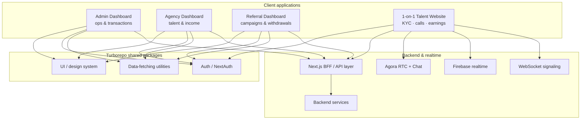
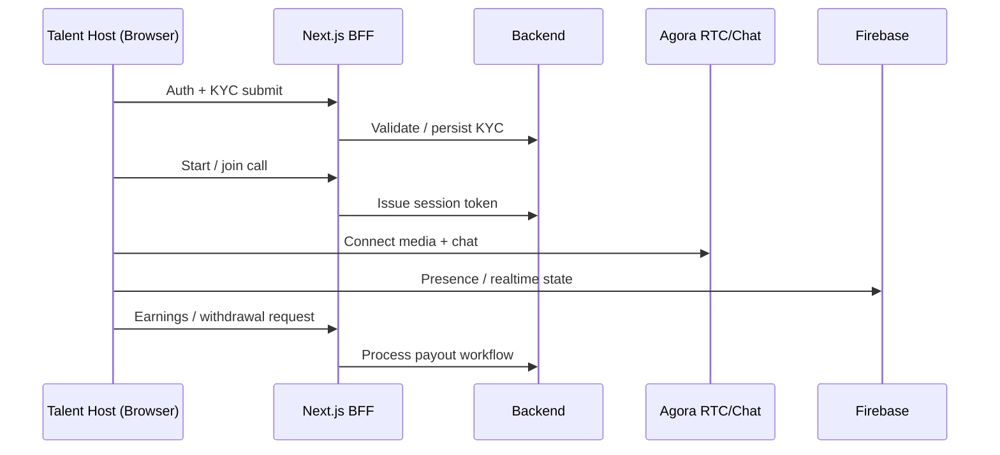
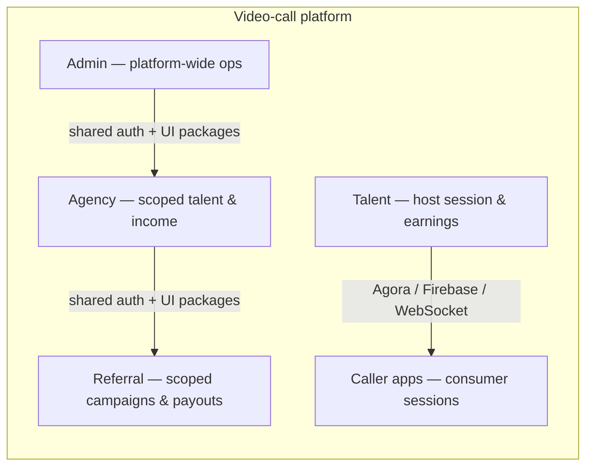

# Case Study — Video Call Platform Frontend Architecture

**Author:** Jordy Andreas  
**Role:** Senior Frontend Developer  
**Company:** PT. Namea Kreasi Teknologi  
**Period:** August 2023 – Present  
**Focus projects:** Video Call Dashboard Suite · 1-on-1 Video Call Website

> **Confidentiality:** Client product under NDA. This writeup is architecture-level only — no proprietary credentials, internal URLs, or customer data. UI screenshots available on request via portfolio.

---

## 1. Context

The video-call product needed separate internal tools for different stakeholders, plus a browser talent platform for hosts:

| Surface | Audience | Primary jobs |
| --- | --- | --- |
| **Admin** | Platform ops | Operations & transactions |
| **Agency** | Agency partners | Talent management & income |
| **Referral** | Referral partners | Campaigns & withdrawals |
| **Talent website** | Talent hosts | KYC, live 1-on-1 calls, chat, earnings, withdrawals |

Duplicating UI systems and authentication across apps would have slowed delivery and created inconsistent UX.

---

## 2. Challenge

- Ship three domain dashboards independently without fragmenting the design system
- Share authentication and data-fetching patterns safely across apps
- Integrate realtime media (Agora), chat, Firebase, and payout flows behind a clear Next.js BFF architecture
- Keep complex host workflows typed and maintainable (forms, query state, UI primitives)
- Support peak realtime usage without sacrificing clarity of frontend architecture

---

## 3. Approach & architecture

I designed and implemented a **Turborepo / pnpm monorepo** with shared packages for UI, auth (NextAuth), and data-fetching. Admin, Agency, and Referral apps consume those packages and talk to backend services through a consistent frontend / BFF layer.

For the talent website, I built KYC onboarding, Agora RTC/Chat, Firebase realtime patterns, and earnings/withdrawal surfaces on Next.js + TypeScript.

### 3.1 Multi-app architecture



### 3.2 Talent host call & payout flow



### 3.3 Role-scoped product surfaces



---

## 4. Tech stack

| Layer | Technologies |
| --- | --- |
| Apps & monorepo | Next.js, TypeScript, Turborepo, pnpm |
| UI | MUI, Tailwind CSS, shadcn/ui |
| State & data | TanStack Query, Zustand, Axios |
| Auth & forms | NextAuth, React Hook Form, Zod |
| Realtime | Agora RTC, Agora Chat, Firebase, WebSocket |

---

## 5. My contributions

- Designed and implemented the Turborepo/pnpm monorepo structure
- Built shared UI and auth packages consumed by Admin, Agency, and Referral
- Delivered the three domain dashboard apps on that foundation
- Built the talent web experience: multi-step KYC → live call/chat → earnings/withdrawals
- Integrated Agora RTC/Chat and Firebase realtime through a Next.js BFF architecture
- Mentored 2 junior frontend engineers through code reviews and shared standards
- Partnered with design and backend to keep UX and performance consistent across Namea web/mobile surfaces

---

## 6. Outcomes

- Modular multi-app frontend architecture with reduced UI/auth duplication
- Consistent authentication and UX across Admin, Agency, and Referral surfaces
- Independently shippable dashboards with shared foundations
- Production realtime talent flows covering onboarding through payouts
- Related performance work across reusable web/mobile patterns (up to ~60% page load improvement on relevant surfaces)

---

## 7. Related frontend highlights (optional context)

| Project | Role focus | Stack highlight |
| --- | --- | --- |
| **Live Sport Website** | Realtime scores under peak traffic | Next.js, TypeScript, Tailwind, WebSockets |
| **Masjidqu** | Mobile worship companion | React Native, Redux, Maps, Firebase, payments |

Play Store (Masjidqu): https://play.google.com/store/apps/details?id=com.namea.masjidqu&hl=id

---

## How to export this to PDF

1. Open this file in Cursor / VS Code preview, or paste into [Mermaid Live](https://mermaid.live) for diagrams.
2. **Easiest:** Paste the full markdown into [HackMD](https://hackmd.io), [Notion](https://notion.so), or Google Docs (recreate diagrams as images from Mermaid Live exports).
3. Export / Download as **PDF**.
4. Suggested filename: `Jordy-Andreas-Case-Study-Video-Call-Platform.pdf`

Alternatively from the repo root (if you have pandoc + a PDF engine):

```bash
pandoc docs/case-studies/video-call-platform-frontend.md \
  -o docs/case-studies/Jordy-Andreas-Case-Study-Video-Call-Platform.pdf \
  --pdf-engine=xelatex
```

Note: Mermaid diagrams may need to be rendered to PNG first for pandoc PDF pipelines.
